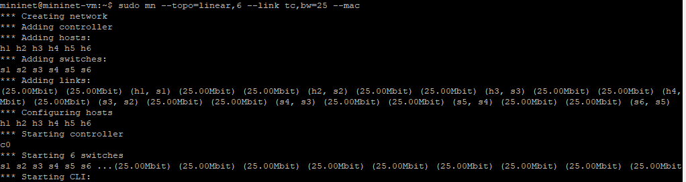
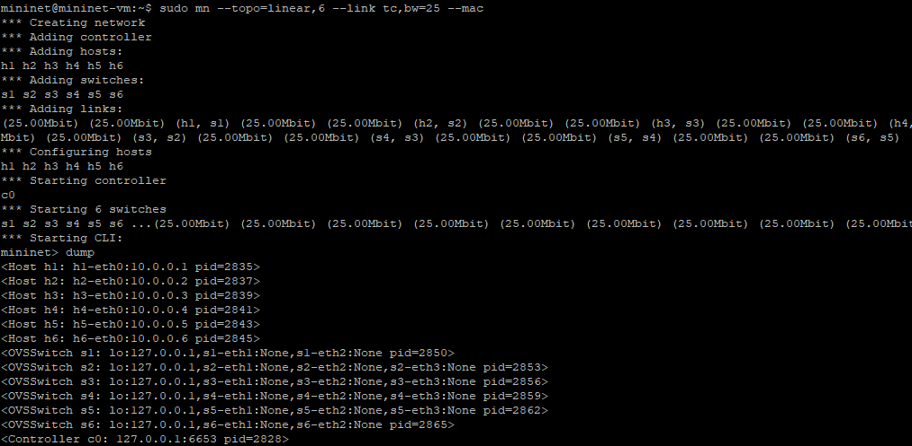
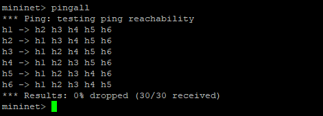
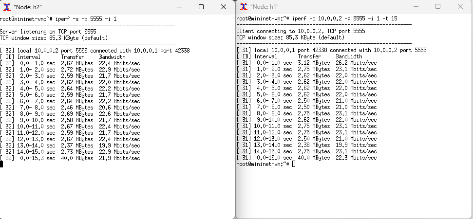

# 🧩 C115-Works

### 🧑‍🏫 Professor: Samuel Beraldi Mafra
### 📘 Autor: Tiago Augusto Carvalho
### 📆 Disciplina: C115 — Conceitos e tecnologias para dispositivos conectados
### 💻 Ferramenta: Mininet


Repositório contendo o trabalho da disciplina **C115**, desenvolvido em **Mininet**, utilizando linha de comando para criar e testar uma topologia linear com 6 switches.

---

## 🟣 Primeiro Ponto
### Criação da topologia linear com 6 switches

**Descrição:**  
Criação da topologia considerando o endereço MAC padronizado, largura de banda de 25 Mbps e o controlador padrão do Mininet (sem necessidade de especificar o tipo de controlador).

**Comando utilizado:**
```bash
sudo mn --topo=linear,6 --link tc,bw=25 --mac
````



## 🟣 Segundo Ponto
### Inspeção de informações das interfaces, endereços MAC, IP e portas

**Descrição:**  
Listar e inspecionar as informações dos nós, conexões e interfaces da topologia criada, através das linhas de comando.

**Comando utilizado:**
```bash
dump
````



## 🟣 Terceiro Ponto
### Testes de ping entre os diferentes nós

**Descrição:**  
Executar testes de conectividade entre todos os nós da topologia para garantir comunicação completa entre os hosts.

**Comando utilizado:**
```bash
pingall
````



## 🟣 Quarto Ponto
### Testes de desempenho com iperf

**Descrição:**  
Configuração do host 1 na porta 5555 como servidor TCP e o host 2 como cliente, executando testes de iperf durante 15 segundos, com relatórios por segundo.

**Comando utilizado:**
```bash
xterm h1 h2
h1 iperf -s -p 5555 &
h2 iperf -c h1 -p 5555 -t 15 -i 1
````



🧠 Resumo dos Comandos
### Para referência rápida, seguem todos os comandos utilizados no trabalho:

**Comando utilizado:**
```bash
# Criação da topologia linear com 6 switches
sudo mn --topo linear,6 --link tc,bw=25

# Inspeção de nós, conexões e interfaces
nodes
net
dump

# Testes de conectividade entre os nós
pingall

# Testes de desempenho com iperf
h1 iperf -s -p 5555 &
h2 iperf -c h1 -p 5555 -t 15 -i 1

# Encerrando topologia e limpando cache
sudo mn -c
````

##✅ Conclusão
### Todas as etapas do trabalho foram executadas com sucesso, contemplando:

**Descrição:  
.Criação da topologia linear no Mininet;
.Inspeção das interfaces e conexões entre nós;
.Testes de conectividade e desempenho entre hosts;
.Limpeza final do ambiente para novas execuções.**


